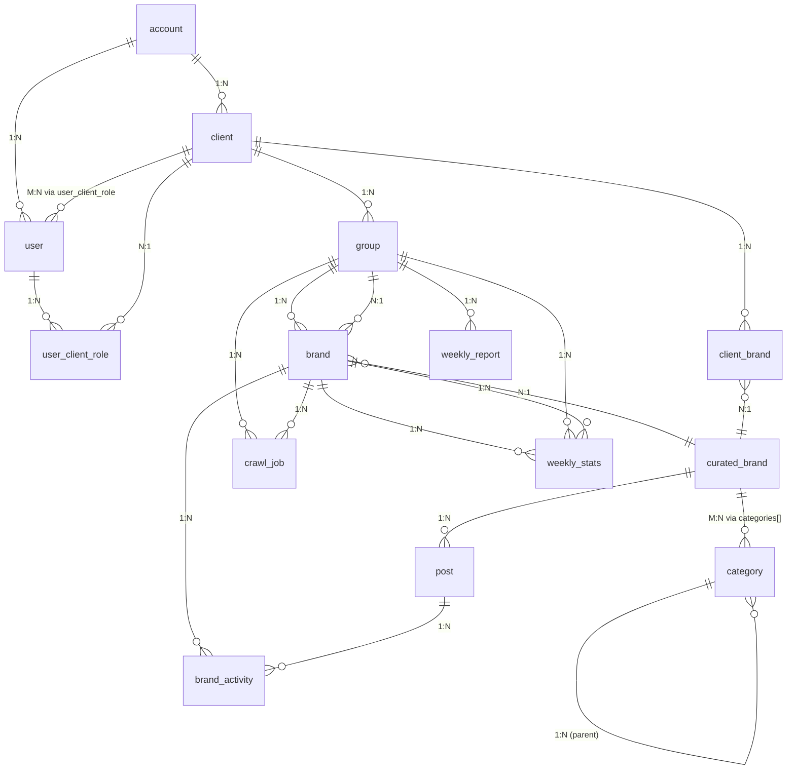

# COBAN — Database Schema Design

> Phân tích crawl logic từ `user-journey-v3.md` (J12) → thiết kế PostgreSQL schema tối ưu cho query speed và ETL pipeline.

---

## 1. Crawl Logic Deep Dive (from J12)

### 1.1 Weekly Crawl Flow (Every Sunday 12:00 PM)

```
Cron (pg_cron)
  │
  ▼
┌─────────────────────────────────────────────────────────────┐
│ Job 1: Crawl Delta                                         │
│  FOR EACH group                                            │
│    FOR EACH brand IN group (primary + competitors)         │
│      crawl_from = Jan 1 of current_year  ← ALWAYS          │
│      → Fetch posts (platform, post_id, metrics)            │
│      → Deduplicate by (platform, post_id)                  │
│      → UPSERT posts table                                  │
│      → Update last_crawl_time                             │
│                                                             │
│  ⚠️ NOT from last_crawl_time! crawl_from luôn = Jan 1     │
│     Lý do: post cũ engagement tăng đột biến → cần recrawl │
└─────────────────────────────────────────────────────────────┘
  │
  ▼
┌─────────────────────────────────────────────────────────────┐
│ Job 2: Gap Calculation — Post-Level                        │
│  Vấn đề: post có thể tồn tại từ năm ngoái nhưng engagement│
│  tăng đột biến tuần này (re-share, viral)                  │
│                                                             │
│  Logic:                                                    │
│  W (tuần hiện tại) vs W-1 (tuần trước)                    │
│  ├── Post trong cả W và W-1 → gap = perf_W - perf_W-1    │
│  │   → "post cũ viral lại"                                │
│  ├── Post CHỈ trong W → gap = perf_W                     │
│  │   → "post mới tuần này"                                │
│  └── Post CHỈ trong W-1 → gap = 0                         │
│      → Không hiển thị trong tuần hiện tại                  │
│                                                             │
│  Ví dụ Nestlé W13:                                        │
│  ├── 3 post cũ W12, viral W13: +40K engagement gap       │
│  ├── 2 post mới W13: +30K engagement gap                  │
│  └── Total: +70K engagement                                │
└─────────────────────────────────────────────────────────────┘
  │
  ▼
┌─────────────────────────────────────────────────────────────┐
│ Job 3: Aggregation — Weekly Brand Stats                    │
│  sum(gap_results) → WEEKLY_STATS (brand × group × week)   │
│  trend = (W - W-1) / W-1                                 │
│  Store: posts, views, impressions, reactions, ER,         │
│         network_breakdown, format_breakdown               │
└─────────────────────────────────────────────────────────────┘
  │
  ▼
┌─────────────────────────────────────────────────────────────┐
│ Job 4: Rankings & SoV                                     │
│  Per group:                                                │
│    total = SUM(impressions all brands)                    │
│    for brand:                                             │
│      sov = brand / total                                  │
│      rank = RANK(BY impressions DESC)                    │
│      beat_rate = % brands mà brand vượt qua               │
│  Alert cho brand mới (added_at tuần này): is_new = true  │
│  Store: WEEKLY_REPORT (group × week)                      │
└─────────────────────────────────────────────────────────────┘
  │
  ▼
┌─────────────────────────────────────────────────────────────┐
│ Job 5: Activity Report                                     │
│  viral_posts = gap > 2x prev perf                        │
│  reengaged = exist W-1 + new eng in W                    │
│  → Activity feed (email + dashboard)                      │
└─────────────────────────────────────────────────────────────┘
  │
  ▼
┌─────────────────────────────────────────────────────────────┐
│ Job 6: Finalize & Notify                                   │
│  status = 'finalized' (nếu >= week_end)                   │
│  Email all users                                           │
└─────────────────────────────────────────────────────────────┘
```

### 1.2 Initial Crawl (First-time setup)

- Trigger: J3, J6, J9, J10 (mỗi khi tạo group mới hoặc thêm competitor)
- Crawl từ **2 năm trước** → hiện tại
- Mục đích: đảm bảo baseline từ Jan 1 → tuần n-1 luôn đầy đủ
- Trạng thái: `group.crawl_status = 'pending'` → 'crawling' → 'ready'

### 1.3 Key Insights cho DB Design

| Insight | Implication |
|---------|-------------|
| **POST belongs to BRAND, not GROUP** | Brand A có thể là primary của group X, là competitor của group Y → 1 post phải hiển thị ở cả 2 group |
| **week_start denormalized** | Luôn filter theo week → cần index trên week_start, tránh `DATE_TRUNC` mỗi query |
| **WEEKLY_STATS là aggregated cache** | Query dashboard hàng ngày → không thể mỗi lần scan POST table. WEEKLY_STATS là materialized aggregate |
| **Crawl = Job execution** | Cần bảng riêng tracking crawl jobs, không chỉ status field |
| **Gap calculation = post-level delta** | Tính từng post W vs W-1, sum lên → cần efficient post-level queries |
| **SOV/SOS per GROUP, not global** | Rankings tính trong phạm vi group (benchmark category) |
| **Brand là cross-client** | TH True Milk có thể là competitor trong 10 groups của 5 clients khác nhau → brand phải là global entity |


---

## 2. Table Architecture

### 2.1 Core Tables ( OLTP — Write once, read many )

```
┌──────────────────────────────────────────────────────────┐
│ TABLE: account                                          │
│ Purpose: Top-level billing entity (agency / direct_client)│
├──────────────────────────────────────────────────────────┤
│ id            uuid PK DEFAULT gen_random_uuid()         │
│ name          varchar(255) NOT NULL                     │
│ type          varchar(20) NOT NULL  -- 'agency', 'direct_client'│
│ plan          varchar(20) NOT NULL  -- 'startup', 'professional', 'enterprise'│
│ max_users     int DEFAULT 5                            │
│ max_clients   int DEFAULT NULL  -- NULL = unlimited    │
│ created_at    timestamptz DEFAULT now()                │
│ updated_at    timestamptz DEFAULT now()                │
├──────────────────────────────────────────────────────────┤
│ INDEX: idx_account_name  ON(name)                       │
└──────────────────────────────────────────────────────────┘

┌──────────────────────────────────────────────────────────┐
│ TABLE: client                                           │
│ Purpose: Client brand/company managed by account        │
│ Strategy: Small table (< 1000 rows), NO partition        │
├──────────────────────────────────────────────────────────┤
│ id            uuid PK DEFAULT gen_random_uuid()         │
│ account_id    uuid FK → account(id) ON DELETE CASCADE   │
│ name          varchar(255) NOT NULL                     │
│ industry      varchar(50) DEFAULT 'other'               │
│ created_at    timestamptz DEFAULT now()                │
│ updated_at    timestamptz DEFAULT now()                │
├──────────────────────────────────────────────────────────┤
│ INDEX: idx_client_account  ON(account_id)               │
│ CONSTRAINT: unique_account_name UNIQUE(account_id, name)│
└──────────────────────────────────────────────────────────┘

┌──────────────────────────────────────────────────────────┐
│ TABLE: "user"                                           │
│ Purpose: Platform users (one per account owner/admin)    │
│ Note: "user" is reserved keyword → quoted               │
├──────────────────────────────────────────────────────────┤
│ id            uuid PK DEFAULT gen_random_uuid()         │
│ account_id    uuid FK → account(id) ON DELETE CASCADE   │
│ email         varchar(255) NOT NULL UNIQUE              │
│ password_hash text NOT NULL  -- bcrypt                  │
│ full_name     varchar(255)                             │
│ role          varchar(20) NOT NULL  -- 'platform_admin',│
│               -- 'agency_owner', 'agency_admin'        │
│ created_at    timestamptz DEFAULT now()                │
│ updated_at    timestamptz DEFAULT now()                │
├──────────────────────────────────────────────────────────┤
│ INDEX: idx_user_email  ON(email)                        │
│ INDEX: idx_user_account  ON(account_id)                  │
└──────────────────────────────────────────────────────────┘

┌──────────────────────────────────────────────────────────┐
│ TABLE: user_client_role                                  │
│ Purpose: Per-client role assignment (user can access     │
│          multiple clients with different roles)           │
│ Strategy: Small table, NO partition                      │
├──────────────────────────────────────────────────────────┤
│ id            uuid PK DEFAULT gen_random_uuid()         │
│ user_id       uuid FK → "user"(id) ON DELETE CASCADE   │
│ client_id     uuid FK → client(id) ON DELETE CASCADE    │
│ role          varchar(20) NOT NULL  -- 'admin', 'analyst', 'viewer'│
│ created_at    timestamptz DEFAULT now()                │
│ updated_at    timestamptz DEFAULT now()                │
├──────────────────────────────────────────────────────────┤
│ INDEX: idx_ucr_user  ON(user_id)                         │
│ INDEX: idx_ucr_client  ON(client_id)                    │
│ CONSTRAINT: unique_user_client UNIQUE(user_id, client_id)│
└──────────────────────────────────────────────────────────┘
```

### 2.2 Brand Tables ( Global entity — shared across clients )

```
┌──────────────────────────────────────────────────────────┐
│ TABLE: curated_brand                                     │
│ Purpose: Platform-wide brand master (seeded by admin)    │
│ Strategy: Small table (~200 rows), NO partition          │
│          All columns denormalized: social handles,       │
│          categories, advertiser stored here              │
├──────────────────────────────────────────────────────────┤
│ id            uuid PK DEFAULT gen_random_uuid()         │
│ name          varchar(255) NOT NULL UNIQUE              │
│ slug          varchar(255) NOT NULL UNIQUE             │
│ categories    text[] NOT NULL DEFAULT '{}'               │
│ social_handles jsonb DEFAULT '{}'                        │
│   -- {facebook: "@handle", youtube: "@handle",          │
│        tiktok: "@handle"}                               │
│ advertiser    varchar(255)  -- top-level, e.g. "IDP"  │
│ status        varchar(20) DEFAULT 'active'             │
│ created_at    timestamptz DEFAULT now()                │
│ updated_at    timestamptz DEFAULT now()                │
├──────────────────────────────────────────────────────────┤
│ INDEX: idx_curated_brand_name_gin                        │
│   ON(lower(name)) GIN trigram gist (for fuzzy search)   │
│ INDEX: idx_curated_brand_status  ON(status)            │
└──────────────────────────────────────────────────────────┘

┌──────────────────────────────────────────────────────────┐
│ TABLE: client_brand                                     │
│ Purpose: Brand instance per client (links curated brand │
│          to client account with client-specific metadata)│
│ Strategy: Small-Medium table, NO partition              │
│          Same brand → multiple clients → multiple rows  │
├──────────────────────────────────────────────────────────┤
│ id            uuid PK DEFAULT gen_random_uuid()         │
│ client_id     uuid FK → client(id) ON DELETE CASCADE    │
│ curated_brand_id  uuid FK → curated_brand(id)          │
│   ON DELETE CASCADE  -- OR SET NULL + custom handling   │
│ name          varchar(255) NOT NULL                     │
│   -- canonical name for this client's view              │
│ categories    text[] DEFAULT '{}'                       │
│ created_at    timestamptz DEFAULT now()                │
│ updated_at    timestamptz DEFAULT now()                │
├──────────────────────────────────────────────────────────┤
│ INDEX: idx_cb_client  ON(client_id)                     │
│ INDEX: idx_cb_curated  ON(curated_brand_id)            │
│ CONSTRAINT: unique_client_curated                       │
│   UNIQUE(client_id, curated_brand_id)                    │
│ CONSTRAINT: unique_client_name                         │
│   UNIQUE(client_id, name)                               │
└──────────────────────────────────────────────────────────┘

┌──────────────────────────────────────────────────────────┐
│ TABLE: category                                         │
│ Purpose: Hierarchical product category tree              │
│ Strategy: Small table (~50 rows), NO partition           │
│          Loaded once, cached in AppContext               │
├──────────────────────────────────────────────────────────┤
│ id            uuid PK DEFAULT gen_random_uuid()         │
│ parent_id     uuid FK → category(id) ON DELETE SET NULL │
│ name          varchar(255) NOT NULL                     │
│ slug          varchar(255) NOT NULL UNIQUE             │
│ created_at    timestamptz DEFAULT now()                │
├──────────────────────────────────────────────────────────┤
│ INDEX: idx_cat_parent  ON(parent_id)                     │
│ CONSTRAINT: no_cyclic_category CHECK (id != parent_id)  │
└──────────────────────────────────────────────────────────┘
```


### 2.3 Group Tables (Group + Brand linking + Crawl tracking)

```
┌──────────────────────────────────────────────────────────┐
│ TABLE: brand                                            │
│ Purpose: BRAND TRACKING — the entity being tracked.     │
│          NOT a master table. This is the canonical link  │
│          between "which brand in which group with what   │
│          status". Every brand in every group = 1 row.   │
│                                                         │
│ WHY SEPARATE FROM group_brand?                          │
│ → Need to track per-(group,brand): crawl_status,        │
│   first_crawl_at, last_crawl_at, is_primary            │
│ → Need a stable brand_id for WEEKLY_STATS lookup       │
│ → This table is the source of truth for "what is being │
│   crawled where"                                        │
│                                                         │
│ CRITICAL INSIGHT: brand_id is NOT curated_brand_id!    │
│   → Brand "Kun" as PRIMARY of group X = 1 brand row    │
│   → Brand "Kun" as COMPETITOR of group Y = ANOTHER row │
│   → They share the same curated_brand_id               │
│   → But have different group_id, is_primary, crawl_status│
├──────────────────────────────────────────────────────────┤
│ id                  uuid PK DEFAULT gen_random_uuid()   │
│ curated_brand_id    uuid FK → curated_brand(id)        │
│ group_id           uuid FK → "group"(id)              │
│ is_primary         boolean DEFAULT false              │
│ source             varchar(20) DEFAULT 'curated'     │
│   -- 'curated' = from platform, 'custom' = user added │
│ crawl_status       varchar(20) DEFAULT 'pending'      │
│   -- 'pending' | 'crawling' | 'ready' | 'error'      │
│ is_new             boolean DEFAULT true               │
│   -- TRUE until 2nd week of crawl in this group       │
│ first_crawl_at     timestamptz                        │
│ last_crawl_at      timestamptz                        │
│ error_message      text                               │
│ created_at         timestamptz DEFAULT now()          │
│ updated_at         timestamptz DEFAULT now()          │
├──────────────────────────────────────────────────────────┤
│ INDEX: idx_brand_group  ON(group_id)                   │
│ INDEX: idx_brand_curated  ON(curated_brand_id)         │
│ INDEX: idx_brand_crawl_status  ON(crawl_status)       │
│ INDEX: idx_brand_is_new  ON(is_new)                   │
│ CONSTRAINT: unique_group_curated                       │
│   UNIQUE(group_id, curated_brand_id)                  │
└──────────────────────────────────────────────────────────┘

┌──────────────────────────────────────────────────────────┐
│ TABLE: "group"                                          │
│ Purpose: Brand + Category + Competitors tracking unit    │
│ Note: "group" is reserved keyword → quoted             │
├──────────────────────────────────────────────────────────┤
│ id                     uuid PK DEFAULT gen_random_uuid()│
│ client_id              uuid FK → client(id)            │
│ name                   varchar(255) NOT NULL           │
│ benchmark_category_id  uuid FK → category(id)         │
│ crawl_status           varchar(20) DEFAULT 'pending'  │
│   -- aggregate: 'pending'|'crawling'|'ready'|'error'  │
│   -- = worst status of all brands in group            │
│ first_crawl_at        timestamptz                     │
│ last_crawl_at         timestamptz                     │
│ created_at            timestamptz DEFAULT now()       │
│ updated_at            timestamptz DEFAULT now()       │
├──────────────────────────────────────────────────────────┤
│ INDEX: idx_group_client  ON(client_id)                 │
│ CONSTRAINT: unique_client_group_name                    │
│   UNIQUE(client_id, name)                             │
└──────────────────────────────────────────────────────────┘

┌──────────────────────────────────────────────────────────┐
│ TABLE: crawl_job                                        │
│ Purpose: Track every crawl execution (not just status)   │
│ Strategy: Append-only log, partition by month/year        │
│                                                         │
│ WHY SEPARATE FROM brand.crawl_status?                  │
│ → Need history: how long did crawl take? how many posts?│
│ → Need retry logic: don't re-crawl if last run < 1h    │
│ → Need audit: what changed between runs?               │
│ → Need progress tracking: which brand is currently      │
│   crawling, what % done?                              │
├──────────────────────────────────────────────────────────┤
│ id               uuid PK DEFAULT gen_random_uuid()     │
│ group_id         uuid FK → "group"(id)                │
│ brand_id         uuid FK → brand(id)                  │
│ job_type         varchar(20) NOT NULL                │
│   -- 'initial' = 2 years back (J3/J6/J9/J10)         │
│   -- 'weekly' = Sunday cron (J12)                    │
│   -- 'retry'  = manual retry after error             │
│ status           varchar(20) NOT NULL                 │
│   -- 'queued'|'running'|'completed'|'failed'         │
│ crawl_from       date NOT NULL  -- Jan 1 or 2y back  │
│ crawl_to         date NOT NULL  -- current week end  │
│ posts_fetched    int DEFAULT 0                       │
│ posts_upserted   int DEFAULT 0                       │
│ started_at       timestamptz                         │
│ completed_at     timestamptz                         │
│ error_message    text                               │
│ retry_count      int DEFAULT 0                       │
│ created_at       timestamptz DEFAULT now()            │
├──────────────────────────────────────────────────────────┤
│ INDEX: idx_cj_group  ON(group_id)                      │
│ INDEX: idx_cj_brand  ON(brand_id)                     │
│ INDEX: idx_cj_status  ON(status)                      │
│ INDEX: idx_cj_created  ON(created_at DESC)            │
│ PARTITION: RANGE (created_at) -- monthly partitions   │
└──────────────────────────────────────────────────────────┘
```

### 2.4 POST Table ( OLAP — Heavy read, partitioned )

```
┌──────────────────────────────────────────────────────────────┐
│ TABLE: post                                                │
│ Purpose: Raw social media post data — source of truth      │
│          for all analytics                                  │
│ Strategy:                                                   │
│   Partitioned by year (2022, 2023, 2024, 2025, ...)       │
│   10K+ rows/year → partition keeps queries fast             │
│   17 columns map 1:1 from CSV                              │
├──────────────────────────────────────────────────────────────┤
│ id               uuid PK DEFAULT gen_random_uuid()         │
│ curated_brand_id  uuid FK → curated_brand(id)              │
│   -- Curated brand, NOT group-brand. Posts belong to brand │
│   -- regardless of which group is tracking it.             │
│ platform         varchar(20) NOT NULL  -- 'facebook', 'youtube', 'tiktok' │
│ post_id          varchar(255) NOT NULL                      │
│   -- External platform ID, e.g. YouTube video ID           │
│ content          text                                        │
│   -- Post message/caption, may contain newlines (multi-line) │
│ posted_at        timestamp NOT NULL                         │
│   -- Original post date from platform                      │
│ week_start       date NOT NULL                             │
│   -- DENORMALIZED for fast week queries (no DATE_TRUNC!)  │
│   -- Pre-computed: Monday of the week containing posted_at │
│ format           varchar(20)  -- 'Image'|'Video'|'True view'|'Bumper'│
│ yt_format        varchar(20)  -- 'Short'|'Normal' (YouTube only)│
│ cost             numeric(18,2)  -- Vietnamese VND          │
│   -- Parsed: replace('₫','').replace('.','').replace(',','.')│
│ views            numeric(18,2) DEFAULT 0                  │
│ impressions      numeric(18,2) DEFAULT 0                  │
│ reactions        numeric(18,2) DEFAULT 0                  │
│   -- Combined: Reactions + Comments + Shares               │
│ duration         int  -- seconds (YouTube only)           │
│ link             varchar(500)                             │
│ advertiser       varchar(255)                             │
│ profile          varchar(255)                             │
│   -- Social handle, e.g. "LOF KUN", "TH true MILK"       │
│ brands           jsonb DEFAULT '[]'                       │
│   -- JSON array of brand names from CSV ["Kun"]          │
│ categories       jsonb DEFAULT '[]'                       │
│   -- JSON array from CSV ["Drinking yogurt"]              │
│ created_at       timestamptz DEFAULT now()                │
│ updated_at       timestamptz DEFAULT now()                │
├──────────────────────────────────────────────────────────────┤
│ PRIMARY KEY: (platform, post_id)                            │
│   -- Deduplication key for upsert. Ensures (FB, abc123)    │
│   -- only exists once even if crawled multiple times.     │
│   -- UUID id kept for FK references.                      │
├──────────────────────────────────────────────────────────────┤
│ INDEX: idx_post_brand_week  ON(curated_brand_id, week_start)│
│ INDEX: idx_post_week_start  ON(week_start)                 │
│   -- Fast filter for dashboard week queries                │
│ INDEX: idx_post_platform  ON(platform)                     │
│ INDEX: idx_post_posted_at  ON(posted_at DESC)              │
│ INDEX: idx_post_format  ON(format)                         │
│ INDEX: idx_post_yt_format  ON(yt_format) WHERE yt_format IS NOT NULL│
│   -- Partial index for YouTube Short filter               │
│ INDEX: idx_post_updated_at  ON(updated_at)                 │
│   -- For crawl dedup (find posts updated since last crawl)│
├──────────────────────────────────────────────────────────────┤
│ CONSTRAINT: unique_post_key UNIQUE(platform, post_id)      │
│ CHECK: platform IN ('facebook','youtube','tiktok')        │
│ CHECK: cost >= 0, views >= 0, impressions >= 0           │
├──────────────────────────────────────────────────────────────┤
│ PARTITION: RANGE (week_start)                              │
│   PARTITION post_2022: VALUES FROM ('2022-01-03') TO ('2023-01-02')│
│   PARTITION post_2023: VALUES FROM ('2023-01-02') TO ('2024-01-01')│
│   PARTITION post_2024: VALUES FROM ('2024-01-01') TO ('2025-01-06')│
│   PARTITION post_2025: VALUES FROM ('2025-01-06') TO ('2026-01-05')│
│   -- Add partition as needed (DDL auto at year boundary)  │
└──────────────────────────────────────────────────────────────┘
```

> **Vấn đề thiết kế đã giải quyết:**
> - `post` belongs to `curated_brand`, NOT to group. Why? Vì 1 post của "Kun" là post của "Kun" bất kể group nào đang track nó. Không cần lưu N bản sao của cùng 1 post cho N groups. `WEEKLY_STATS` sẽ tự join để filter theo group context.
> - `week_start` denormalized: avoid `DATE_TRUNC('week', posted_at)` in every query. Pre-computed at insert time.
> - `platform + post_id` as PK for efficient upsert (ON CONFLICT DO UPDATE).
> - `updated_at` index: crawl re-runs only need to find posts updated since last run → fast delta detection.

---

## 3. Weekly Stats & Aggregated Tables

### 3.1 weekly_stats ( Materialized Aggregate Cache )

```
┌──────────────────────────────────────────────────────────────┐
│ TABLE: weekly_stats                                         │
│ Purpose: Pre-aggregated weekly metrics per (brand × group × week)│
│          THE MOST QUERIED TABLE in the entire system         │
│ Strategy:                                                    │
│   Updated every Sunday after crawl completes                 │
│   Dashboard reads from here (not from POST table)           │
│   ~200 brands × 52 weeks = 10,400 rows/year                  │
│   Small enough for full table scan, but partition helps      │
├──────────────────────────────────────────────────────────────┤
│ id                 uuid PK DEFAULT gen_random_uuid()       │
│ brand_id           uuid FK → brand(id)  -- group-scoped brand │
│ group_id           uuid FK → "group"(id)                   │
│ year               int NOT NULL                             │
│ week_number        int NOT NULL                             │
│ week_start         date NOT NULL                            │
│ week_end           date NOT NULL                            │
│ total_posts        int NOT NULL DEFAULT 0                   │
│ total_views        numeric(18,2) DEFAULT 0                  │
│ total_impressions  numeric(18,2) DEFAULT 0                  │
│ total_reactions    numeric(18,2) DEFAULT 0                  │
│ total_cost         numeric(18,2) DEFAULT 0                  │
│ avg_engagement_rate float DEFAULT 0                        │
│   -- total_reactions / total_views × 100                   │
│ gap_pct            float  -- WoW change, null for first week│
│ is_new             boolean DEFAULT false                   │
│ network_breakdown  jsonb DEFAULT '{}'                       │
│   -- {"facebook": 5000, "youtube": 10000, "tiktok": 3000} │
│ format_breakdown   jsonb DEFAULT '{}'                       │
│   -- {"Image": 1000, "Video": 2000, "True view": 6000}     │
│ created_at         timestamptz DEFAULT now()               │
│ updated_at         timestamptz DEFAULT now()               │
├──────────────────────────────────────────────────────────────┤
│ INDEX: idx_ws_group_week  ON(group_id, week_start) DESC      │
│ INDEX: idx_ws_brand_week  ON(brand_id, week_start) DESC   │
│ INDEX: idx_ws_brand_group  ON(brand_id, group_id, week_start)│
│   -- For gap calculation queries (W vs W-1 merge)          │
│ INDEX: idx_ws_year_week  ON(year, week_number)             │
│ CONSTRAINT: unique_ws_group_brand_week                      │
│   UNIQUE(group_id, brand_id, week_start)                    │
│ CHECK: week_number BETWEEN 1 AND 53                        │
│ CHECK: week_start < week_end                               │
└──────────────────────────────────────────────────────────────┘
```

### 3.2 weekly_report ( Group-level weekly rollup )

```
┌──────────────────────────────────────────────────────────────┐
│ TABLE: weekly_report                                        │
│ Purpose: Group-level weekly summary + status + alerts     │
│          ONE ROW per (group, week) = report for that week  │
│ Strategy: ~500 groups × 52 weeks = ~26K rows/year          │
│          Small, no partition needed                         │
├──────────────────────────────────────────────────────────────┤
│ id                 uuid PK DEFAULT gen_random_uuid()       │
│ group_id           uuid FK → "group"(id)                   │
│ year               int NOT NULL                            │
│ week_number        int NOT NULL                            │
│ week_start         date NOT NULL                            │
│ week_end           date NOT NULL                            │
│ total_posts        int DEFAULT 0                           │
│ total_views        numeric(18,2) DEFAULT 0                 │
│ total_impressions  numeric(18,2) DEFAULT 0                 │
│ total_reactions    numeric(18,2) DEFAULT 0                 │
│ status             varchar(20) DEFAULT 'ongoing'           │
│   -- 'ongoing' (week not over yet) | 'finalized'          │
│ alerts             jsonb DEFAULT '[]'                     │
│   -- [{type: "new_brand", brand: "Nestlé", note: "..."}]  │
│ email_sent_at      timestamptz                            │
│ created_at         timestamptz DEFAULT now()               │
│ updated_at         timestamptz DEFAULT now()               │
├──────────────────────────────────────────────────────────────┤
│ INDEX: idx_wr_group_week  ON(group_id, week_start)          │
│ INDEX: idx_wr_year_week  ON(year, week_number)             │
│ CONSTRAINT: unique_wr_group_week UNIQUE(group_id, week_start)│
└──────────────────────────────────────────────────────────────┘
```

### 3.3 brand_activity ( Viral / Re-engaged post tracking )

```
┌──────────────────────────────────────────────────────────────┐
│ TABLE: brand_activity                                       │
│ Purpose: Activity log — viral posts, re-engaged, anomalies  │
│ Strategy: Append-only, partition by month. ~1000 rows/week │
│          Lifetime: 1 year (auto-archive older)             │
├──────────────────────────────────────────────────────────────┤
│ id              uuid PK DEFAULT gen_random_uuid()         │
│ brand_id        uuid FK → brand(id)                        │
│ post_id         uuid FK → post(id)                        │
│ activity_type   varchar(20) NOT NULL                       │
│   -- 'viral' | 'reengaged' | 'anomaly' | 'new_post'       │
│ week_start      date NOT NULL                              │
│ prev_perf       numeric(18,2)  -- W-1 metric               │
│ curr_perf       numeric(18,2)  -- W metric                │
│ change_pct      float  -- (curr - prev) / prev × 100     │
│ summary         text  -- "Engagement tăng 300% (2K → 8K)" │
│ notified        boolean DEFAULT false                      │
│ created_at      timestamptz DEFAULT now()                  │
├──────────────────────────────────────────────────────────────┤
│ INDEX: idx_ba_brand_week  ON(brand_id, week_start)          │
│ INDEX: idx_ba_type_week  ON(activity_type, week_start)      │
│ INDEX: idx_ba_notified  ON(notified) WHERE notified = false│
│ PARTITION: RANGE (week_start) -- monthly                   │
└──────────────────────────────────────────────────────────────┘
```
---

## 4. Entity-Relationship Diagram



### 4.1 Schema Summary Table

| # | Table | Type | Rows/Year (est.) | Partition | Purpose |
|---|-------|------|-----------------|----------|---------|
| 1 | `account` | OLTP | < 100 | No | Billing + user container |
| 2 | `client` | OLTP | < 2K | No | Brand/company per account |
| 3 | `"user"` | OLTP | < 5K | No | Auth + identity |
| 4 | `user_client_role` | OLTP | < 10K | No | Per-client RBAC |
| 5 | `curated_brand` | Lookup | ~200 | No | Platform-wide brand master |
| 6 | `client_brand` | Lookup | < 1K | No | Brand instance per client |
| 7 | `category` | Lookup | ~50 | No | Hierarchical product categories |
| 8 | `"group"` | OLTP | ~500/yr | No | Brand grouping unit |
| 9 | `brand` | OLTP | ~2K/yr | No | Brand-in-group tracking (PER BRAND PER GROUP = 1 row) |
| 10 | `crawl_job` | Append | ~10K/yr | Yes (monthly) | Crawl execution log |
| 11 | `post` | OLAP | ~50K/yr | Yes (yearly) | Raw post data (source of truth) |
| 12 | `weekly_stats` | Aggregate | ~10K/yr | No | Pre-computed weekly metrics |
| 13 | `weekly_report` | Aggregate | ~26K/yr | No | Group-level weekly rollup |
| 14 | `brand_activity` | Append | ~52K/yr | Yes (monthly) | Viral/re-engaged activity log |

---

## 5. Common Query Patterns (Optimized for speed)

### 5.1 Dashboard — Overview Section (Most common)

```sql
-- Get all brands in a group for latest week (Section A: KPI cards + SOV)
SELECT
    b.id,
    cb.name,
    b.is_primary,
    ws.total_posts,
    ws.total_impressions,
    ws.total_reactions,
    ws.gap_pct,
    ws.is_new,
    ws.network_breakdown,
    ws.avg_engagement_rate
FROM brand b
JOIN curated_brand cb ON cb.id = b.curated_brand_id
JOIN weekly_stats ws ON ws.brand_id = b.id
    AND ws.week_start = :latest_week_start
WHERE b.group_id = :group_id
ORDER BY ws.total_impressions DESC;
-- Uses: idx_ws_group_week (group_id, week_start DESC)
```

### 5.2 Rankings Table (Section B)

```sql
-- SOV matrix + ranking for all brands in group, latest week
WITH total AS (
    SELECT SUM(ws.total_impressions) AS grand_total
    FROM weekly_stats ws
    WHERE ws.group_id = :group_id
      AND ws.week_start = :week_start
)
SELECT
    RANK() OVER (ORDER BY ws.total_impressions DESC) AS rank,
    cb.name AS brand,
    ws.total_impressions,
    ROUND(ws.total_impressions * 100.0 / t.grand_total, 2) AS sov_pct,
    ws.gap_pct,
    ws.is_new,
    ws.network_breakdown,
    ws.format_breakdown
FROM weekly_stats ws
JOIN brand b ON b.id = ws.brand_id
JOIN curated_brand cb ON cb.id = b.curated_brand_id
CROSS JOIN total t
WHERE ws.group_id = :group_id
  AND ws.week_start = :week_start
ORDER BY rank;
-- Uses: idx_ws_group_week + window functions
```

### 5.3 Gap Calculation (W vs W-1)

```sql
-- Gap for specific brand (for Section E: Benchmark)
SELECT
    ws_curr.year,
    ws_curr.week_number,
    ws_curr.week_start,
    ws_curr.total_impressions,
    ws_curr.total_reactions,
    ws_prev.total_impressions AS prev_impressions,
    ws_prev.total_reactions AS prev_reactions,
    ws_curr.gap_pct,
    ws_curr.is_new
FROM weekly_stats ws_curr
LEFT JOIN weekly_stats ws_prev ON ws_prev.brand_id = ws_curr.brand_id
    AND ws_prev.week_start = ws_curr.week_start - INTERVAL '7 days'
WHERE ws_curr.brand_id = :brand_id
ORDER BY ws_curr.week_start DESC
LIMIT 26;  -- 6 months
-- Uses: idx_ws_brand_week (brand_id, week_start DESC)
```

### 5.4 Weekly Crawl — Delta Detection (for Job 1)

```sql
-- Find posts updated since last crawl (delta crawl)
SELECT platform, post_id, posted_at, week_start, updated_at
FROM post
WHERE curated_brand_id = :curated_brand_id
  AND week_start >= DATE_TRUNC('year', CURRENT_DATE)
  AND updated_at > :last_crawl_time
ORDER BY updated_at;
-- Uses: idx_post_brand_week (brand_id, week_start) + idx_post_updated_at
```

### 5.5 Weekly Stats Aggregation (from POST to WEEKLY_STATS, Job 3)

```sql
-- Compute weekly_stats from post table
INSERT INTO weekly_stats (
    brand_id, group_id, year, week_number,
    week_start, week_end, total_posts, total_views,
    total_impressions, total_reactions, total_cost,
    avg_engagement_rate, network_breakdown, format_breakdown,
    is_new
)
SELECT
    b.id,
    b.group_id,
    EXTRACT(ISOYEAR FROM p.week_start)::int,
    EXTRACT(WEEK FROM p.week_start)::int,
    DATE_TRUNC('week', p.week_start)::date,
    (DATE_TRUNC('week', p.week_start) + INTERVAL '6 days')::date,
    COUNT(*),
    SUM(p.views),
    SUM(p.impressions),
    SUM(p.reactions),
    SUM(p.cost),
    CASE WHEN SUM(p.views) > 0
         THEN (SUM(p.reactions)::float / SUM(p.views)) * 100
         ELSE 0 END,
    jsonb_object_agg(p.platform, SUM(p.impressions))
        FILTER (WHERE p.platform IS NOT NULL),
    jsonb_object_agg(p.format, COUNT(*))
        FILTER (WHERE p.format IS NOT NULL),
    b.is_new
FROM post p
JOIN brand b ON b.curated_brand_id = p.curated_brand_id
WHERE p.week_start >= :start_of_year
  AND b.group_id IN (
      -- All groups for this account's clients
      SELECT g.id FROM "group" g
      JOIN client c ON c.id = g.client_id
      WHERE c.account_id = :account_id
  )
GROUP BY b.id, b.group_id, b.is_new,
    EXTRACT(ISOYEAR FROM p.week_start),
    EXTRACT(WEEK FROM p.week_start),
    DATE_TRUNC('week', p.week_start)
ON CONFLICT (group_id, brand_id, week_start)
DO UPDATE SET
    total_posts = EXCLUDED.total_posts,
    total_views = EXCLUDED.total_views,
    total_impressions = EXCLUDED.total_impressions,
    total_reactions = EXCLUDED.total_reactions,
    total_cost = EXCLUDED.total_cost,
    avg_engagement_rate = EXCLUDED.avg_engagement_rate,
    network_breakdown = EXCLUDED.network_breakdown,
    format_breakdown = EXCLUDED.format_breakdown,
    updated_at = now();
```

### 5.6 Post-level Gap (Job 2 — W vs W-1 per post)

```sql
-- Find post gap: viral posts (engagement > 2x) in current week
WITH prev_week AS (
    SELECT platform, post_id, SUM(reactions) AS prev_reactions
    FROM post
    WHERE week_start = :prev_week
      AND curated_brand_id = :curated_brand_id
    GROUP BY platform, post_id
),
curr_week AS (
    SELECT platform, post_id, SUM(reactions) AS curr_reactions
    FROM post
    WHERE week_start = :curr_week
      AND curated_brand_id = :curated_brand_id
    GROUP BY platform, post_id
)
SELECT
    c.platform, c.post_id,
    COALESCE(p.prev_reactions, 0) AS prev_reactions,
    c.curr_reactions,
    CASE WHEN p.prev_reactions > 0
         THEN ROUND((c.curr_reactions - p.prev_reactions)::numeric
                    / p.prev_reactions * 100, 1)
         ELSE NULL END AS change_pct
FROM curr_week c
LEFT JOIN prev_week p USING (platform, post_id)
WHERE c.curr_reactions > 2 * COALESCE(p.prev_reactions, 1);
```
---

## 6. Performance & Indexing Strategy

### 6.1 Partitioning Plan

```
post table: RANGE on week_start (yearly)
  ├── post_2022  -- Jan 3, 2022 → Jan 2, 2023   (~8K rows)
  ├── post_2023  -- Jan 2, 2023 → Jan 1, 2024   (~15K rows)
  ├── post_2024  -- Jan 1, 2024 → Jan 6, 2025   (~12K rows)
  ├── post_2025  -- Jan 6, 2025 → Jan 5, 2026   (~10K rows/est.)
  └── post_default -- catch-all for future years

crawl_job: RANGE on created_at (monthly)
  └── Fast pruning for old job history

brand_activity: RANGE on week_start (monthly)
  └── Fast pruning for old activity logs
```

### 6.2 Materialized Views (for slow dashboard queries)

```sql
-- Materialized view: latest week rankings per group
-- Refresh: every Sunday after crawl completes
CREATE MATERIALIZED VIEW mv_latest_rankings AS
SELECT
    ws.group_id,
    ws.week_start,
    ROW_NUMBER() OVER (PARTITION BY ws.group_id
        ORDER BY ws.total_impressions DESC) AS rank,
    b.id AS brand_id,
    cb.name AS brand_name,
    ws.total_impressions,
    ws.total_reactions,
    ws.gap_pct
FROM weekly_stats ws
JOIN brand b ON b.id = ws.brand_id
JOIN curated_brand cb ON cb.id = b.curated_brand_id
WHERE ws.week_start = (
    SELECT MAX(week_start) FROM weekly_stats
);

CREATE UNIQUE INDEX ON mv_latest_rankings(group_id, brand_id);

-- Usage: instant rankings display without aggregation
SELECT * FROM mv_latest_rankings
WHERE group_id = :group_id
ORDER BY rank;
```

### 6.3 Brand Normalization (Alias Mapping)

```sql
-- Brand alias table for resolving CSV variations → canonical brand
CREATE TABLE brand_alias (
    id uuid PRIMARY KEY DEFAULT gen_random_uuid(),
    curated_brand_id uuid REFERENCES curated_brand(id),
    alias varchar(255) NOT NULL UNIQUE,
    created_at timestamptz DEFAULT now()
);

-- GIN index for fast lookup
CREATE INDEX idx_brand_alias_gin
ON brand_alias USING GIN (lower(alias) gin_trgm_ops);

-- Example: "Kun", "KUN", "KUN Vietnam", "Kun - Sữa Tươi"
--   → canonical: "Kun" (curated_brand)
```

### 6.4 Full-Text Search

```sql
-- Post content search (for keyword analysis in Section D)
CREATE INDEX idx_post_content_fts
ON post USING GIN (to_vector(content));  -- PostgreSQL 16+ tsvector

-- Or fallback for older PG:
CREATE INDEX idx_post_content_gin
ON post USING GIN (to_tsvector('english', content));
```

---

## 7. Migration Strategy (from current TDD schema → new schema)

### 7.1 Step-by-step Migration

```
Phase 1: Schema Creation (Zero-downtime)
  1. Create all new tables alongside old ones
  2. Add NEW tables: brand, crawl_job, brand_activity
  3. Rename old tables → old_xxx (backup)
  4. Create triggers to keep old and new in sync

Phase 2: Data Migration
  1. Migrate account → account
  2. Migrate client → client
  3. Migrate "user" → "user"
  4. Migrate curated_brand ← (new: populate from existing BRAND data)
  5. Migrate group → "group"
  6. Migrate brand ← extract from GROUP_BRAND + GROUP_COMPETITOR
  7. Migrate post → post (partitioned)
  8. Compute weekly_stats from migrated post data
  9. Compute weekly_report from weekly_stats

Phase 3: Verify & Cutover
  1. Run validation queries comparing old vs new aggregates
  2. Point application to new schema
  3. Monitor for 48 hours
  4. Drop old tables
```

### 7.2 Backward Compatibility View (for gradual cutover)

```sql
-- View that provides old table names with new schema
CREATE VIEW BRAND AS
SELECT
    b.id,
    b.curated_brand_id,
    b.group_id,
    b.is_primary,
    b.crawl_status,
    b.created_at,
    cb.name AS name
FROM brand b
JOIN curated_brand cb ON cb.id = b.curated_brand_id;
```

---

## 8. Design Decisions & Rationale

| # | Decision | Why | Alternative Considered |
|---|----------|-----|----------------------|
| 1 | **POST belongs to `curated_brand`, NOT `brand` (group-scoped)** | 1 post = 1 brand. Không cần N bản sao nếu N groups track cùng brand. `weekly_stats` join qua `brand` table để filter theo group context | ✅ POST → brand_id (group-scoped) — rejected: redundant storage |
| 2 | **`brand` table is group-scoped (NOT global)** | `curated_brand_id` + `group_id` = unique. Same brand in different groups = different rows. Track separate crawl_status, is_primary, is_new per group | ✅ One global brand table with group_brand junction — rejected: too many FK hops |
| 3 | **`week_start` denormalized on POST** | Every query filters by week. `DATE_TRUNC` on every query = expensive. Pre-compute at insert time | ✅ Compute on-the-fly — rejected: too slow for dashboard |
| 4 | **Separate `crawl_job` table** | Job history, retry logic, progress tracking cannot live in a simple status field. Need execution metadata | ✅ Status field on brand table — rejected: no history, no retry |
| 5 | **`platform + post_id` as PK for POST** | Natural key for deduplication. Ensures upsert works correctly (crawl same post twice → no duplicates) | ✅ UUID only — rejected: no dedup guarantee |
| 6 | **`weekly_stats` pre-aggregated** | Dashboard queries must return in < 200ms. Scanning 50K+ posts per query = unacceptable | ✅ Aggregate on-demand — rejected: too slow |
| 7 | **`is_new` on `brand` (not on `weekly_stats`)** | Brand "mới" determination is a property of the brand-in-group relationship, not of a specific week. First 2 weeks of crawl in a group = is_new = true | ✅ is_new on weekly_stats — rejected: semantic mismatch |
| 8 | **`curated_brand` + `client_brand` split** | curated_brand = platform-wide master. client_brand = client-specific instance. Allow clients to customize brand name/aliases while sharing canonical data | ✅ Single brand table with client_id — rejected: can't share across clients cleanly |
| 9 | **Partition `post` by year, not by brand** | Query pattern = filter by week + brand. Year partition prunes ~95% of data (2025 queries don't scan 2022). Brand filter within partition | ✅ Partition by brand — rejected: too many partitions (200+ brands) |
| 10 | **`brands` and `categories` on POST as JSONB** | CSV contains `["Kun"]` and `["Drinking yogurt"]`. Can parse at ingest or store as-is for flexible querying | ✅ Separate junction tables — rejected: too many rows for simple tag arrays |

---

## 9. Comparison: Old TDD Schema → New Schema

| Aspect | Old TDD (12 tables) | New Schema (14 tables) |
|--------|---------------------|----------------------|
| **Brand Model** | `BRAND.client_id` (1:N) — ambiguous ownership | `curated_brand` (global) + `client_brand` (per-client) + `brand` (per-group) — 3-layer model |
| **POST FK** | `POST.group_id` — posts belong to group | `POST.curated_brand_id` — posts belong to brand (platform-wide) |
| **Crawl Status** | `GROUP.crawl_status` (single) + duplicate on GROUP_COMPETITOR | `brand.crawl_status` (per-brand) + `group.crawl_status` (computed worst-of) |
| **Job Tracking** | None | `crawl_job` (full execution history) |
| **New Brand Flag** | Missing | `brand.is_new` (per group, tracks "🆕 Mới" badge) |
| **Brand Added** | Not tracked | Implicit in `brand.created_at` (for first-week-no-gap logic) |
| **ERD Conflicts** | 2 conflicting ERDs in same doc | Single consistent ERD |
| **Partition** | `POST` by year only | `POST` by year, `crawl_job` monthly, `brand_activity` monthly |
| **Query Speed** | O(n) scan on POST | O(1) on `weekly_stats`, partition prune on POST |
