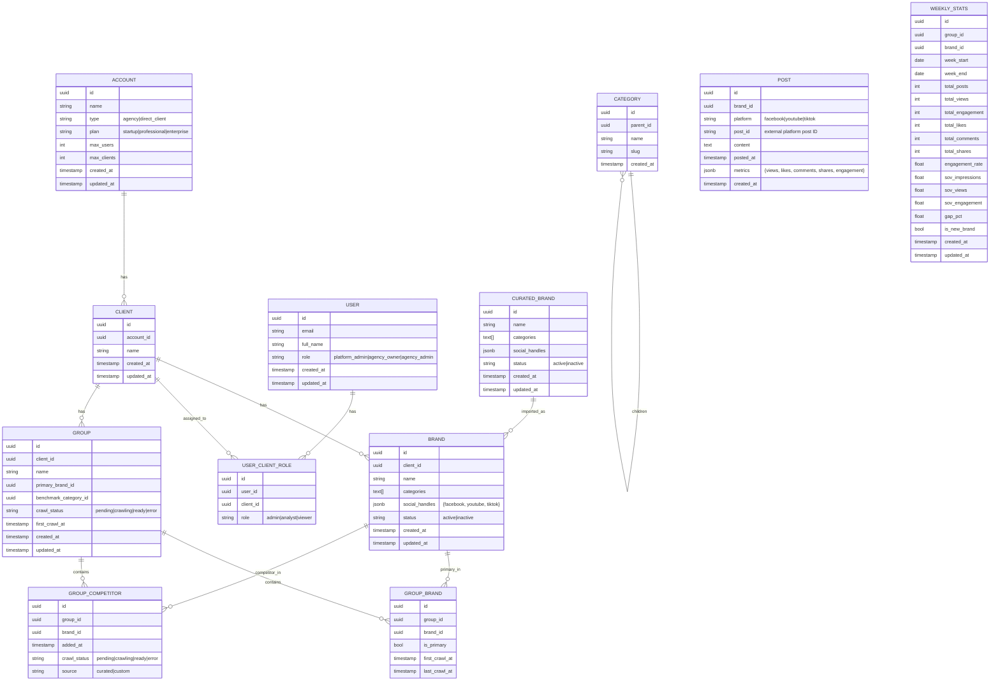
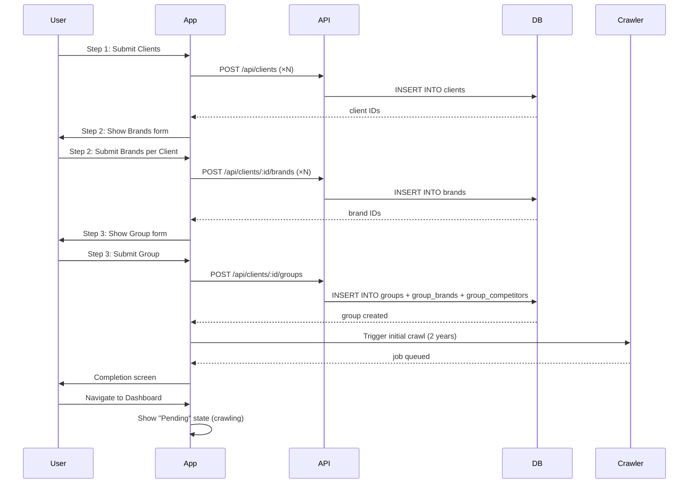
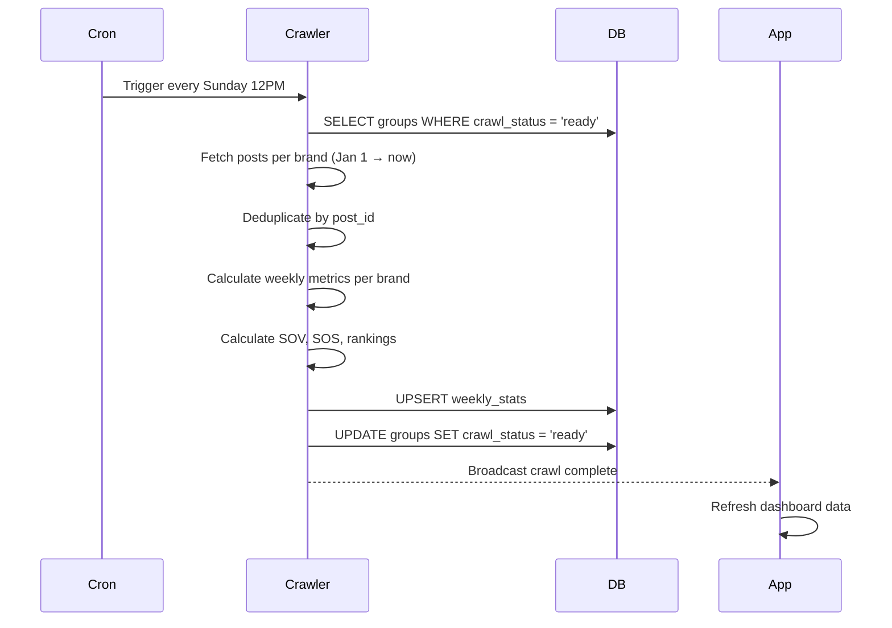
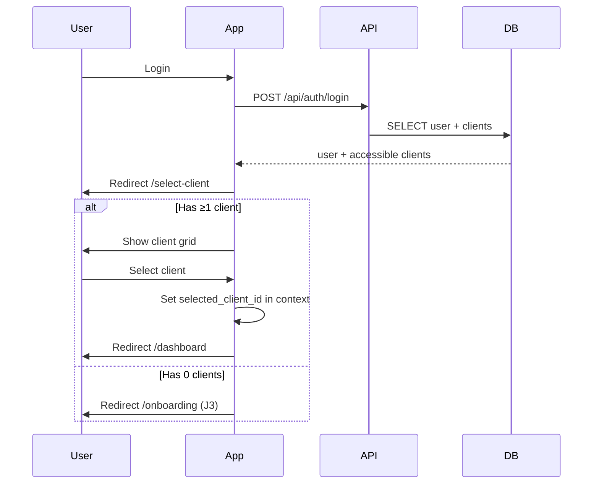
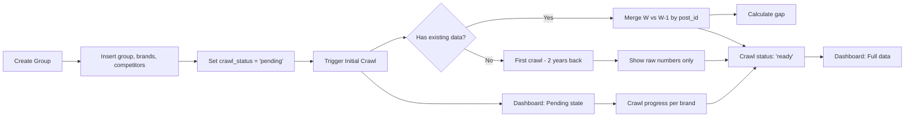

# Technical Design Document: COBAN Platform

## 1. Overview

COBAN là nền tảng Social Media Competitive Intelligence dành cho thị trường Việt Nam. Nền tảng giúp các agency và brand theo dõi, phân tích đối thủ cạnh tranh trên Facebook, YouTube, và TikTok thông qua hệ thống crawl data tự động hàng tuần (mỗi Chủ Nhật 12:00 PM), hiển thị trên dashboard analytics chuyên sâu.

**Phạm vi tài liệu này:** Thiết kế kỹ thuật toàn bộ nền tảng COBAN — từ data model, API, UI pages, logic xử lý, đến testing plan — dựa trên `user-journey-v3.md` (12 journeys J1–J12) và `pagemetric.md` (6 dashboard sections A–F).

**Phạm vi KHÔNG bao gồm:** Chi tiết crawler (cách crawl từng platform), payment gateway integration, email template design.

---

## 2. Requirements

### 2.1 Functional Requirements

**FR-001:** Platform Admin có thể seed categories (tree structure) và curated brands (100+ brands với social handles) — J1

**FR-002:** Platform Admin có thể tạo agency account và invite owner user — J2

**FR-003:** Agency Owner có thể hoàn thành 3-step onboarding wizard: khai báo Clients → Brands → Group đầu tiên — J3

**FR-004:** Agency Owner có thể mời users và gán roles per-client (admin/analyst/viewer) — J4

**FR-005:** User sau login được chọn 1 client để làm việc — J5

**FR-006:** User có thể tạo Group đầu tiên cho client chưa có group — J6

**FR-007:** Dashboard hiển thị đầy đủ 6 sections: Overview, Rankings, Channel Performance, Content Strategy, Benchmark, Trends — J7 + pagemetric.md

**FR-008:** User có thể tạo thêm Group thứ hai (hoặc thứ N) cho cùng client — J8

**FR-009:** User có thể thêm/bớt competitor vào group, trigger crawl lại — J9

**FR-010:** Direct Client có thể signup, chọn plan, hoàn thành compact onboarding (2 steps) — J10

**FR-011:** Hệ thống crawl tự động mỗi tuần (Chủ Nhật 12:00 PM), merge data W vs W-1 theo post_id — J12

**FR-012:** Dashboard hiển thị trạng thái pending (đang crawl) khi group mới tạo/chỉnh sửa

**FR-013:** Brand mới thêm vào group hiển thị badge "🆕 Mới", tuần đầu chỉ hiện số tuyệt đối, tuần thứ 2 bắt đầu tính gap

**FR-014:** KPI Cards format số lớn (VD: 1.2M, 18K), trend arrows (▲/▼), percentage change

**FR-015:** Rankings sortable (Impressions/Views/Engagement/ER), với sparklines và SOS matrix

### 2.2 Non-Functional Requirements

**NFR-001:** Dashboard load < 2s với mock data, < 5s với PostgreSQL queries

**NFR-002:** Crawl lần đầu (2 năm data): 30–90 phút tùy số brands

**NFR-003:** Tất cả API endpoints phải secured với JWT authentication (local PostgreSQL)

**NFR-004:** PostgreSQL Row Security policies: agency chỉ thấy data của account mình

**NFR-005:** Responsive design: mobile drawer nav, tablet 2-col, desktop full layout

**NFR-006:** Định dạng tuần: W13 (12 Apr – 18 Apr, 2025) trên toàn bộ UI

**NFR-007:** Weekly crawl: Jan 1 current year → hiện tại, deduplicate by post_id

**NFR-008:** Định dạng số Việt Nam: dấu chấm phân cách nghìn, dấu phẩy cho decimal (VD: 1.234.567,89)

---

## 3. Technical Design

### 3.1. Data Model

> **Source Data Reference:** `total data dairy 12_3 - Competitor (1).csv`
> - 10,797 rows, date range: 1/1/2022 → 9/9/2024
> - 17 columns: Post Date, Profile, Network, Format, Cost, Message, Reactions/Comments/Shares, Link, Messag ID, Views, Duration, Advertiser, Brand, Categories, Impression, YT Format
> - Networks: YOUTUBE (51.6%), FACEBOOK (33.4%), TIKTOK (15.0%)
> - Formats: True view (50.6%), Video (27.8%), Image (20.6%), Bumber (1%)
> - 109 unique brands (after normalization), 15 advertisers, 27 profiles

> **Database Schema:** Full table definitions (14 tables, 955 lines) are in `DB_SCHEMA_DESIGN.md`.
> Reference that file for exact column types, indexes, constraints, partitioning strategy, and ERD.

**Data Ingestion Pipeline:**
1. CSV Parser reads raw source → `POST` table (1:1 mapping)
2. Brand Normalization: canonical name + aliases stored in `BRAND`, linked via brand name matching
3. Aggregation Job: runs after each crawl → computes `WEEKLY_STATS` per (group, brand, week)
4. Weekly rollup: `POST` rows → `WEEKLY_STATS` aggregates (SUM views, impressions, reactions; COUNT posts; AVG ER)
5. SOV/SOS calculation: per (group, week) across all brands in group



### 3.2. API Changes

#### Auth
```
POST /api/auth/login
  Body: { email, password }
  Response: { user: { id, email, name, role }, access_token, clients[] }

POST /api/auth/signup
  Body: { email, password, account_type, account_name }
  Response: { user_id, account_id }

POST /api/auth/logout
  Response: { success: true }

GET /api/auth/session
  Response: { user, clients[], selected_client? }
  → Uses local PostgreSQL + bcrypt + jose (JWT)
```

#### Clients
```
GET /api/clients
  Response: { clients: [{ id, name, brands_count, groups_count }] }

POST /api/clients
  Body: { name }
  Response: { client: { id, name } }

PUT /api/clients/:id
  Body: { name }
  Response: { client }

DELETE /api/clients/:id
  Response: { success }
```

#### Brands
```
GET /api/clients/:clientId/brands
  Response: { brands: [{ id, name, categories, social_handles, status }] }

POST /api/clients/:clientId/brands
  Body: { name, categories[], social_handles }
  Response: { brand }

PUT /api/brands/:id
  Body: { name, categories[], social_handles, status }
  Response: { brand }

DELETE /api/brands/:id
  Response: { success }
```

#### Groups
```
GET /api/clients/:clientId/groups
  Response: { groups: [{ id, name, primary_brand, competitor_count, crawl_status }] }

POST /api/clients/:clientId/groups
  Body: { name, primary_brand_id, benchmark_category_id, competitor_ids[] }
  Response: { group, crawl_status: "pending" }

PUT /api/groups/:id
  Body: { name, primary_brand_id, benchmark_category_id }
  Response: { group }

DELETE /api/groups/:id
  Response: { success }
```

#### Competitors
```
GET /api/groups/:groupId/competitors
  Response: { competitors: [{ id, brand, source, crawl_status, added_at }] }

POST /api/groups/:groupId/competitors
  Body: { brand_id?, name?, platform?, url?, is_custom }
  Response: { competitor, crawl_status: "pending" }

DELETE /api/groups/:groupId/competitors/:id
  Response: { success }
```

#### Dashboard
```
GET /api/groups/:groupId/overview?week=W13
  Response: {
    kpis: { impressions, views, engagement, posts, avg_er, market_size },
    sov: [{ brand, network, share }],
    network_dist: [{ network, share }],
    insights: [{ text, type }]
  }

GET /api/groups/:groupId/rankings?week=W13&network=all&sort=impressions
  Response: {
    sov_matrix: [{ brand, youtube, facebook, tiktok }],
    sos_matrix: [{ brand, youtube_delta, facebook_delta, tiktok_delta }],
    ranking_table: [{ brand, rank, impressions, sov, views, engagement, er, sparkline[] }]
  }

GET /api/groups/:groupId/channel-performance?week=W13&network=youtube
  Response: {
    kpis: { impressions, views, engagement, er, posts, avg_per_post },
    format_mix: [{ format, share }],
    duration_vs_er: [{ duration_bucket, er }],
    posting_cadence: [{ month, brand, count }]
  }

GET /api/groups/:groupId/content?week=W13
  Response: {
    format_performance: [{ format, network, engagement }],
    top_keywords: [{ keyword, count }],
    top_posts: [{ brand, profile, network, format, views, engagement, er, date, url }]
  }

GET /api/groups/:groupId/benchmark?week=W13&brand=xxx&competitors[]=yyy
  Response: {
    radar: [{ axis, brand_value, competitor_values[] }],
    head_to_head: [{ metric, brand, competitors[] }],
    gap_analysis: [{ metric, gap_pct, severity }]
  }

GET /api/groups/:groupId/trends?weeks=8&metrics=impressions&brands[]=xxx
  Response: {
    time_series: [{ week, brand, value }],
    seasonality: [{ period, event, impact }],
    anomalies: [{ week, brand, metric, deviation, type }]
  }
```

#### Users
```
GET /api/clients/:clientId/users
  Response: { users: [{ id, email, name, role, last_active }] }

POST /api/clients/:clientId/users/invite
  Body: { email, name, roles: [{ client_id, role }] }
  Response: { invite_sent: true }

PUT /api/users/:id/roles
  Body: { roles: [{ client_id, role }] }
  Response: { user }

DELETE /api/users/:id
  Response: { success }
```

#### Crawler
```
POST /api/crawler/trigger
  Body: { group_id, brands[] }
  Response: { job_id, status: "queued" }

GET /api/crawler/status/:groupId
  Response: {
    status: "pending|crawling|ready|error",
    brands: [{ brand_id, status, progress_pct, error? }]
  }
```

### 3.3. UI Changes

#### Landing Page (`/`)
- Hiện tại: ✅ Đã có đầy đủ sections

#### Select Client (`/select-client`) — J5
- Grid cards: mỗi card = tên client + brands count + groups count + icon
- "Chọn client →" button per card
- Nếu chưa có client → redirect `/onboarding`
- Lưu `selected_client_id` vào AppContext + URL param

#### Onboarding Wizard (`/onboarding`) — J3
- **Step 1:** Khai báo Clients (form thêm nhiều, xóa)
- **Step 2:** Khai báo Brands per client (chọn client → thêm brands)
- **Step 3:** Tạo Group đầu tiên (tên + primary brand + category + competitors)
- Progress indicator (Step 1 of 3)
- Preview panel ở Step 3
- Completion screen → redirect `/select-client`

#### Dashboard (`/dashboard`) — J7
- **Header selectors:** `[Client ▼] [Group ▼] [W13 ✓ Finalized ▼] [User]`
- **Tab navigation:** Overview | Rankings | Channel | Content | Benchmark | Trends
- **Tab: Overview (A):** KPI Cards + SOV Chart + Network Donut + Quick Insights
- **Tab: Rankings (B):** SOV Matrix + SOS Matrix + Ranking Table + Filters
- **Tab: Channel (C):** YouTube/FB/TT sub-tabs + KPIs + Format Mix + Cadence
- **Tab: Content (D):** Format bar + Keywords + Top 20 Posts
- **Tab: Benchmark (E):** Brand selector + Radar + Head-to-head + Gap
- **Tab: Trends (F):** Line charts + Compare + Seasonality + Anomalies
- **Pending State:** Khi crawl_status ≠ ready → "⏳ Đang thu thập dữ liệu..." + progress per brand

#### Groups Management (`/dashboard/groups`)
- Grid/list view: mỗi group = name + primary brand + competitor count + status badge
- `[+ Tạo nhóm mới]` button
- Edit / Delete actions

#### Add Competitor (`/dashboard/groups/[id]/competitors`) — J9
- Competitor list table: brand + source + status + added_at
- `[+ Thêm đối thủ]` button → modal: search curated + custom URL
- Confirmation dialog kèm warning về brand mới

#### Team (`/dashboard/team`) — J4
- User list: avatar + name + email + roles per client + last active
- `[+ Mời thành viên]` → modal: email + assign clients + roles

#### Auth (`/auth/login`, `/auth/signup`)
- `/auth/login`: email + password + "Forgot password" + "Sign up link"
- `/auth/signup`: email + password + account type (Agency / Direct Client)

### 3.4. Logic Flow

#### Onboarding Wizard Flow


#### Weekly Crawl Flow


#### Client Selection Flow


#### Group Creation & Pending State Flow


### 3.5. Dependencies

| Package | Purpose | Version |
|---------|---------|---------|
| `next` | Framework | 15.x |
| `react` | UI | 19.x |
| `typescript` | Type safety | 5.x |
| `tailwindcss` | Styling | 3.x |
| `postgres` / `pg` | PostgreSQL Node.js driver | 4.x |
| `bcryptjs` | Password hashing | 2.x |
| `jose` | JWT generation/verification | 5.x |
| `recharts` | Charts | 2.x |
| `@radix-ui/react-*` | UI primitives | latest |
| `lucide-react` | Icons | latest |
| `react-hook-form` | Form handling | 7.x |
| `zod` | Schema validation | 3.x |
| `sonner` | Toast notifications | latest |
| `date-fns` | Date formatting | 3.x |
| `nuqs` | URL state (client/group/week) | 2.x |

**Local PostgreSQL Setup:**
- Docker Compose: `postgres:16-alpine` + `adminer` (optional web UI)
- Connection via `DATABASE_URL` env var
- Migrations: raw SQL files in `db/migrations/`
- Seed data: `db/seed.sql` (categories + curated brands from CSV analysis)

### 3.6. Security Considerations

- **Authentication:** Local PostgreSQL + bcrypt (password hashing) + jose (JWT)
  - JWT stored in httpOnly cookie, 24h expiry, refresh token rotation
  - Passwords hashed with bcrypt (cost factor 12)
- **Authorization:** PostgreSQL Row Security Policies (RLS) on all tables:
  - `clients`: `account_id = current_user.account_id`
  - `groups`, `brands`: `client_id IN (SELECT id FROM clients WHERE account_id = current_user.account_id)`
  - `users`: Platform Admin only
- **Input validation:** Zod schemas on all API handlers and forms
- **SQL injection:** Prevented by pg parameterized queries (no string interpolation)
- **XSS:** React auto-escapes; avoid `dangerouslySetInnerHTML`
- **CORS:** Next.js API routes — server-side only, no CORS issues
- **Rate limiting:** Custom middleware (in-memory for MVP, Redis for production)
- **Custom competitor URLs:** Validate URL format before storing

### 3.7. Performance Considerations

- **Dashboard initial load:** Static shell → client-side data fetch (SWR or React Query pattern via fetch)
- **Charts:** Recharts lazy-loaded per tab (dynamic imports)
- **Week picker:** Max 52 weeks in dropdown; paginate if needed
- **Top 20 Posts table:** Server-side pagination (limit 20, offset)
- **Trend charts (8 weeks):** Aggregate to weekly totals before sending to client
- **Crawl status polling:** Poll every 30s during pending state, stop when 'ready'
- **Category tree:** Loaded once, cached in context
- **Curated brands search:** Debounced search (300ms), PostgreSQL `ILIKE` filter with GIN index
- **POST table:** Partitioned by year (2022, 2023, 2024) for query performance
- **WEEKLY_STATS:** Materialized aggregates refreshed after each crawl run
- **Brand aliases:** Full-text search on `aliases[]` array column for normalization

---

## 4. Testing Plan

### 4.1 Unit Tests
- **AppContext:** get/set selected_client, selected_group, selected_week
- **Mock data generators:** consistent data across dashboard tabs, matching CSV schema (Views with .00, VND format)
- **Week formatter:** `W13 (12 Apr – 18 Apr, 2025)` parsing and formatting
- **Number formatter:** `1.2M`, `18K`, `1.5%` + Vietnam locale `1.234.567,89`
- **CSV parser:** handle multiline Message fields, JSON array parsing for Brand/Categories
- **Brand normalizer:** consolidate brand aliases (Kun vs "Kun - Sữa Tươi", etc.)
- **Zod schemas:** validate all API request/response shapes
- **Dashboard components:** render with mock data, verify chart data structures
- **Onboarding wizard:** step navigation, form validation, data aggregation before API calls

### 4.2 Integration Tests
- **Auth flow:** login → JWT cookie → logout (local PostgreSQL bcrypt)
- **Onboarding flow:** 3 steps → API calls → redirect to select-client
- **Select client flow:** grid display → select → dashboard load
- **Group creation flow:** form → API → pending state → ready state
- **Add competitor flow:** search → add → confirmation → pending state
- **Dashboard API routes:** verify response shape matches pagemetric.md sections
- **RLS policies:** verify agency A cannot access agency B's data via direct SQL queries
- **CSV ingestion:** parse raw data → POST table → WEEKLY_STATS aggregates via direct SQL queries

### 4.3 E2E Tests (Playwright)
- **J3:** Complete 3-step onboarding wizard as Agency Owner
- **J5:** Login → select client → land on dashboard
- **J6:** Select client with no groups → create first group
- **J7:** Verify dashboard renders all 6 tabs with data
- **J9:** Navigate to competitor page → add competitor → verify pending state
- **J12:** Trigger weekly crawl → verify data updates on dashboard

### 4.4 Visual Regression Tests
- KPI cards with all trend states (up/down/neutral)
- Charts with empty data, single brand, multiple brands
- Mobile/tablet/desktop layouts for dashboard
- Pending state vs ready state dashboard
- Onboarding wizard step transitions

---

## 5. Open Questions

1. **Payment gateway:** Stripe hay VNPay? Cần tích hợp thanh toán cho J10 (Direct Client signup).
2. **Custom competitor URL validation:** Cần xác định platform từ URL (Facebook/YouTube/TikTok) hay user chọn? Spec hiện tại cho user chọn platform.
3. **Category tree depth:** Cho phép bao nhiêu cấp? Spec J1 không giới hạn rõ ràng.
4. **Curated brands count:** Seed bao nhiêu? Spec nói "100+" nhưng cần con số cụ thể.
5. **Report export:** PDF hay CSV? Export cho ai? Spec J7 mention "Tải Báo Cáo" nhưng chưa rõ format.
6. **Alert thresholds:** Cấu hình alert như thế nào? Spec J12 mention "alerts" nhưng chưa chi tiết.
7. **Brand social handles:** Curated brands cần handle chính xác hay chỉ cần tên + category? Spec nói "social handles" nhưng crawl system chưa được mô tả chi tiết.
8. **Direct Client plan selection:** Chọn plan trước hay sau signup? Spec J10 nói "Chọn plan → Thanh toán" nhưng flow chi tiết chưa rõ.

---

## 6. Alternatives Considered

### 6.1 State Management
- **Chosen:** React Context (AppContext) + URL params (nuqs)
- **Rejected alternatives:**
  - Redux Toolkit: Overkill cho app chỉ cần 3 state fields (client, group, week)
  - Zustand: Thêm dependency không cần thiết khi Context đủ dùng
  - URL-only state: Không đủ cho client-side selected brand in Benchmark tab

### 6.2 Charting Library
- **Chosen:** Recharts
- **Rejected alternatives:**
  - Chart.js: Không có TypeScript support tốt như Recharts, React integration yếu
  - Visx: Quá low-level, tốn thời gian implement
  - Tremor: UI framework-coupled, khó customize

### 6.3 Dashboard Routing
- **Chosen:** Single `/dashboard` page với tab state (query param)
- **Rejected alternatives:**
  - Separate routes per tab (`/dashboard/overview`, `/dashboard/rankings`): Tốt cho SEO nhưng duplicated layout code
  - Nested routes với shared layout: Phức tạp hơn cần thiết

### 6.4 Crawl Trigger
- **Chosen:** Server-side cron job (node-cron or external cron via `pg_cron`)
- **Rejected alternatives:**
  - Client-side trigger: Không reliable, user có thể không online
  - Webhook từ social platforms: Platforms không cung cấp webhook cho public data
  - Real-time crawling: Tốn tài nguyên, không cần thiết cho weekly analytics

### 6.5 Gap Calculation Strategy
- **Chosen:** Merge by post_id W vs W-1, subtract old week performance
- **Rejected alternatives:**
  - Pure delta crawl (chỉ crawl tuần này): Không biết post nào là cũ, engagement nào là mới
  - Full re-crawl mỗi tuần: Tốn resource, không scale được
  - Sliding window: Phức tạp hơn cần thiết, khó debug

---

## Appendix: File Structure

```
app/
├── page.tsx                              # Landing page ✅
├── layout.tsx
├── globals.css
├── select-client/page.tsx                # [NEW] J5
├── onboarding/
│   ├── page.tsx                          # [NEW] J3 wizard
│   ├── step-clients.tsx
│   ├── step-brands.tsx
│   └── step-group.tsx
├── auth/login/page.tsx                   # [NEW]
├── auth/signup/page.tsx                  # [NEW]
├── dashboard/
│   ├── layout.tsx                        # [UPDATE]
│   ├── page.tsx                          # [UPDATE] tab-based
│   ├── groups/
│   │   ├── page.tsx                      # [NEW]
│   │   ├── new/page.tsx                  # [NEW] J6/J8
│   │   └── [id]/competitors/page.tsx    # [NEW] J9
│   ├── team/page.tsx                     # [NEW] J4
│   └── settings/page.tsx
├── api/
│   ├── auth/login/route.ts
│   ├── auth/signup/route.ts
│   ├── auth/logout/route.ts
│   ├── auth/session/route.ts
│   ├── clients/route.ts
│   ├── clients/[id]/route.ts
│   ├── clients/[id]/brands/route.ts
│   ├── clients/[id]/groups/route.ts
│   ├── clients/[id]/users/route.ts
│   ├── groups/[id]/route.ts
│   ├── groups/[id]/competitors/route.ts
│   ├── groups/[id]/overview/route.ts   # [NEW] Section A
│   ├── groups/[id]/rankings/route.ts    # [NEW] Section B
│   ├── groups/[id]/channel-performance/route.ts  # [NEW] Section C
│   ├── groups/[id]/content/route.ts     # [NEW] Section D
│   ├── groups/[id]/benchmark/route.ts    # [NEW] Section E
│   ├── groups/[id]/trends/route.ts      # [NEW] Section F
│   ├── brands/[id]/route.ts
│   └── crawler/trigger/route.ts
└── user-journeys/page.tsx                # ✅

components/
├── dashboard/
│   ├── header.tsx                        # [UPDATE] selectors
│   ├── sidebar.tsx                       # ✅
│   ├── tabs-nav.tsx                      # [NEW]
│   ├── overview/                         # [NEW] Section A
│   ├── rankings/                         # [NEW] Section B
│   ├── channel/                          # [NEW] Section C
│   ├── content/                          # [NEW] Section D
│   ├── benchmark/                        # [NEW] Section E
│   └── trends/                           # [NEW] Section F
├── onboarding/                           # [NEW]
├── ui/                                   # shadcn/ui ✅

lib/
├── db.ts                               # PostgreSQL connection pool
├── auth.ts                             # bcrypt + jose JWT helpers
├── app-context.tsx                     # [NEW]
├── mock-data.ts                        # [NEW]
├── formatters.ts                       # [NEW] number, week, date formatting
└── schemas.ts                          # [NEW] Zod schemas

db/
├── migrations/
│   ├── 001_initial_schema.sql
│   ├── 002_rls_policies.sql
│   └── 003_seed_categories_brands.sql
└── seed.sql                             # categories + curated brands

lib/
├── db.ts                                # PostgreSQL connection pool
├── auth.ts                              # bcrypt + jose auth helpers
├── mock-data.ts                         # [NEW]
├── formatters.ts                        # [NEW] number, week, date formatting
└── schemas.ts                            # [NEW] Zod schemas
```
